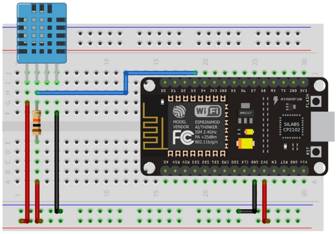
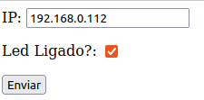

# NodeMCU
Projetos que utilizam NodeMCU ESP8266-12 V2 

## [WebServer+DHT11](WebServer%2BDHT11)
Projeto que implementa um WebServer e utiliza um DHT11 conectado na porta D3 para coletar informações de temperatura e umidade.

## [LedOnline](LedOnline)
Projeto que implementa a possibilidade de acionar um led remotamente utilizando método POST. Você pode, a partir do seu browser acessar o seguinte:
- Ligar o led: http://192.168.0.112/?led=ON
- Desligar o led: http://192.168.0.112/?led=OFF

Ou você pode abrir o arquivo  a partir do seu browser e utilizar a interface para enviar o POST:

**Observação:** Não esqueça de substituir o endereço IP pelo IP do seu NodeMCU.
 
## [NodeMQTT](nodemqtt)
Projeto que implementa a transmissão do status de um botão através da utilização do protocolo MQTT.

**Observação:** Não esqueça de alterar o código, informando sua rede Wifi e o Mosquito Broker.

